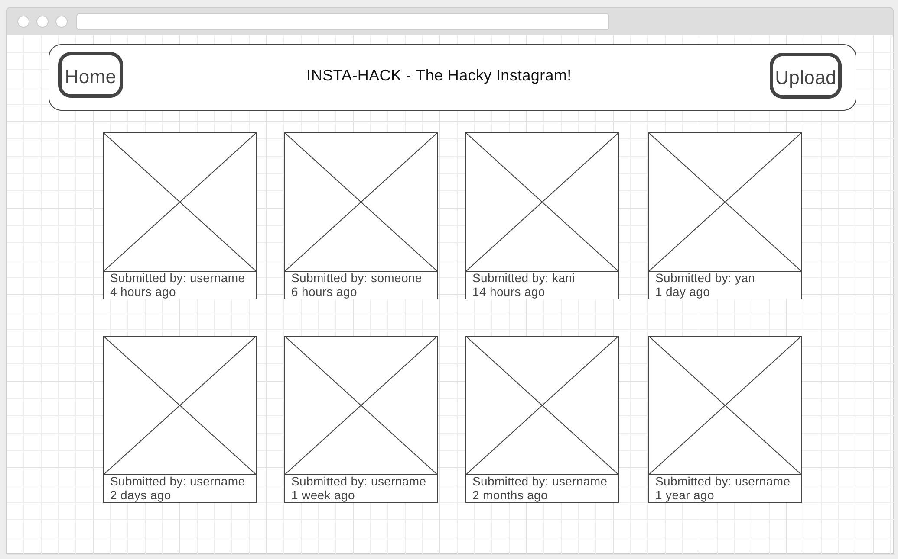
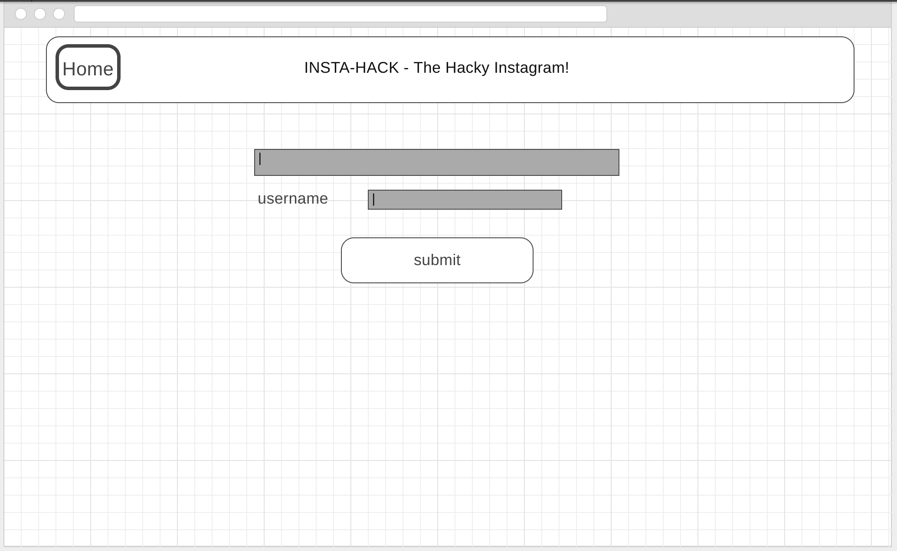
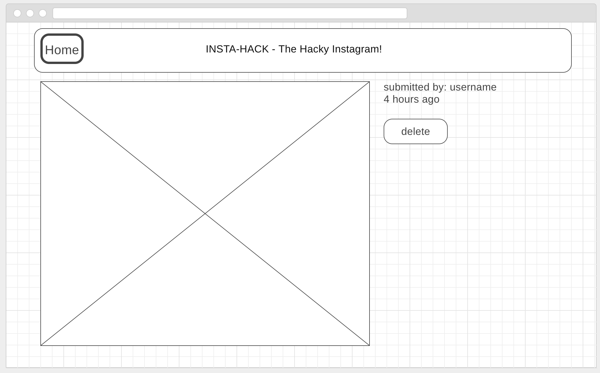

# React Redux
### This was created during my time as a [Code Chrysalis](https://codechrysalis.io) Student

Using the following technologies, build a webapp where users can submit image URLs and view images.

## Objectives

* Create a UI structure using React components
* Use the react-redux library to manage the state and dispatches for the application

## Requirements

* uses webpack to bundle the frontend JS files
* uses React to create the view components
* uses Redux to manage the state and props
* uses multiple components that pass value and method props to each other
* does not use a “starter” codebase (build this from scratch)

## Tips

* You'll want to use the [Moment](https://momentjs.com/) library to handle the times.

## Wireframes

These are wireframes for you to mock.

The main app will have a "Home" and "Upload" buttons as well as show all of the available images.

"Upload" will bring you to the upload page.

And clicking on a photo will lead you to a single photo page, which has information as well as a delete button (which will remove the image).

## Photo Displayer User Stories

* As a user, I can see a list of available images, as well as who uploaded it and when it was uploaded
* As a user, I can submit an image URL to be displayed
* As a user, I can click on an image to view it
* As a user, I can remove an image
